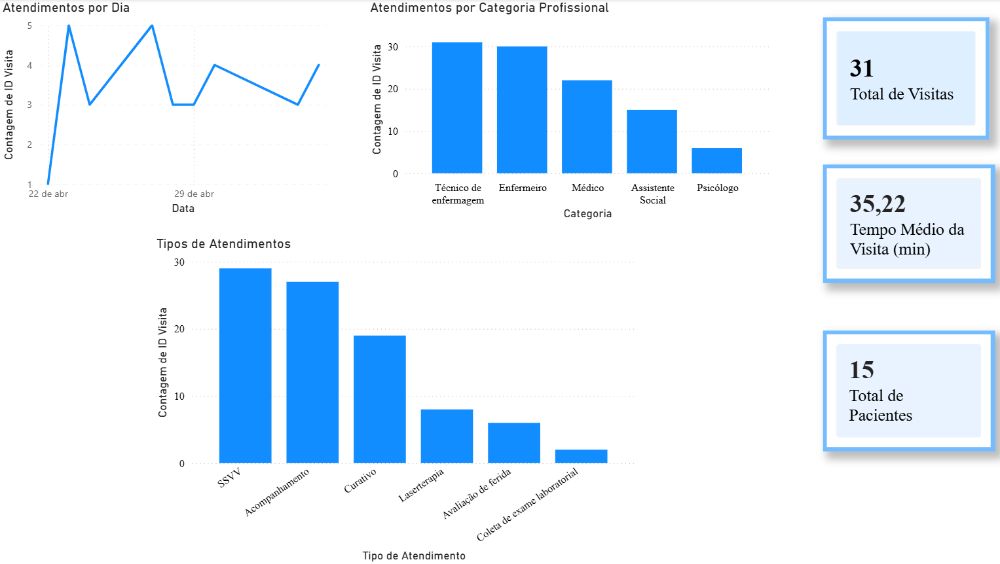

# Dashboard de Indicadores Assistenciais

Projeto desenvolvido em Power BI para monitoramento de indicadores assistenciais e apoio à tomada de decisão.

## Objetivos
- Monitorar indicadores assistenciais
- Acompanhar produtividade das equipes
- Analisar tipos de atendimento realizados
- Apoiar a tomada de decisão baseada em dados

## Ferramentas utilizadas
- Power BI
- Power Query
- Excel

## Funcionalidades
- KPIs
- Gráficos interativos
- Segmentação de dados
- Análise de indicadores

## Indicadores Monitorados

- Total de visitas
- Tempo médio de atendimento
- Total de pacientes atendidos
- Atendimentos por categoria profissional
- Atendimentos por tipo de procedimento
  
## Dashboard

